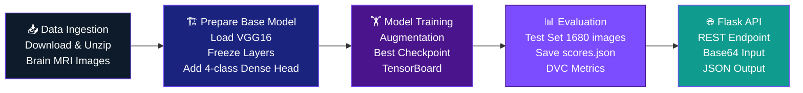
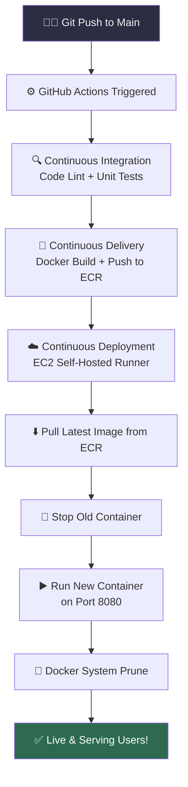

<div align="center">

<!-- Animated Header -->


<!-- Typing Animation -->
<a href="https://git.io/typing-svg">
  
</a>

<br/><br/>

<!-- Badges -->


<br/>


</div>

---

## 🌟 About The Project

> **An end-to-end MLOps pipeline for automated detection and classification of brain tumors from MRI scans using Deep Learning — from data ingestion to cloud deployment.**

Brain tumors affect millions of people worldwide and early, accurate diagnosis is critical for treatment outcomes. Manual MRI analysis is time-consuming and requires expert radiologists. This project tackles that challenge with a production-grade AI system that classifies brain MRI scans into 4 categories — **Glioma**, **Meningioma**, **Pituitary Tumor**, or **No Tumor** — enabling faster, automated screening support.

What makes this project stand out is not just the model, but the **complete MLOps infrastructure** built around it:
- ⚙️ Reproducible DVC-managed pipelines
- 🔁 Automated CI/CD from code push to cloud deployment
- 🐳 Docker containerization for environment consistency
- ☁️ AWS-native deployment with ECR + EC2
- 🌐 REST API for real-time inference

---

## 📸 Project Highlights

<div align="center">

| 🎯 Problem | 🔬 Approach | 🏆 Result |
|:---:|:---:|:---:|
| Brain tumor classification from MRI | VGG16 Transfer Learning | **89.7% Val Accuracy** |
| Manual MRI reading is slow & costly | 4-class automated classification | Real-time REST API |
| No reproducibility in experiments | DVC pipeline versioning | Fully reproducible runs |
| Manual deployments are error-prone | GitHub Actions CI/CD | Push-to-deploy automation |

</div>

---

## 🏗️ System Architecture

```
┌─────────────────────────────────────────────────────────────────┐
│                  🧠 BRAIN TUMOR CLASSIFIER SYSTEM                │
├─────────────────────────────────────────────────────────────────┤
│                                                                   │
│  📦 DATA LAYER              🧠 MODEL LAYER                       │
│  ┌──────────────┐           ┌─────────────────────────────┐      │
│  │ Data Source  │──────────▶│  VGG16 (ImageNet weights)   │      │
│  │ (HuggingFace)│           │  + Custom Dense Head (x4)   │      │
│  └──────────────┘           │  + Adam Optimizer (lr=0.001)│      │
│         │                   └─────────────────────────────┘      │
│         ▼                              │                          │
│  ┌──────────────┐                     ▼                          │
│  │ DVC Pipeline │           ┌─────────────────────────────┐      │
│  │  Stage 1: Data Ingest    │  Training Pipeline           │      │
│  │  Stage 2: Base Model     │  + TensorBoard Logging       │      │
│  │  Stage 3: Training  │    │  + Best Model Checkpointing  │      │
│  │  Stage 4: Evaluation│    │  + Data Augmentation         │      │
│  └──────────────┘           └─────────────────────────────┘      │
│                                                                   │
│  🚀 DEPLOYMENT LAYER                                             │
│  ┌──────────────────────────────────────────────────────────┐    │
│  │  GitHub Push → CI (Lint/Test) → Docker Build → ECR Push  │    │
│  │  → EC2 Pull → Container Run → Flask API (port 8080) ✅   │    │
│  └──────────────────────────────────────────────────────────┘    │
│                                                                   │
└─────────────────────────────────────────────────────────────────┘
```

---

## 🔄 ML Pipeline (DVC)



---

## 🚀 CI/CD Pipeline



---

## 📂 Project Structure

```
Brain-Tumor-MRI-Classifier/
│
├── 📁 .github/
│   └── workflows/
│       └── main.yaml              # CI/CD GitHub Actions pipeline
│
├── 📁 .dvc/                       # DVC configuration
│
├── 📁 artifacts/                  # Auto-generated model artifacts
│   ├── data_ingestion/            # Downloaded MRI dataset (Training/ Testing/)
│   ├── prepare_base_model/        # VGG16 base + updated models (.h5)
│   ├── prepare_callbacks/         # TensorBoard logs + checkpoints
│   └── training/                  # Final trained model
│
├── 📁 config/
│   └── config.yaml                # All path & URL configurations
│
├── 📁 research/                   # Jupyter notebooks (exploration)
│   ├── data_ingestion.ipynb
│   ├── prepare_base_model.ipynb
│   ├── training.ipynb
│   └── 05_model_evaluation.ipynb
│
├── 📁 src/cnnClassifier/
│   ├── components/                # Core ML components
│   │   ├── data_ingestion.py
│   │   ├── prepare_base_model.py  # VGG16 transfer learning
│   │   ├── prepare_callbacks.py   # TensorBoard + checkpointing
│   │   ├── training.py            # Train + best model saving
│   │   └── evaluation.py
│   ├── pipeline/                  # Stage orchestrators
│   │   ├── stage_01_data_ingestion.py
│   │   ├── stage_02_prepare_base_model.py
│   │   ├── stage_03_training.py
│   │   ├── stage_04_evaluation.py
│   │   └── predict.py             # 4-class inference pipeline
│   └── utils/common.py
│
├── 📁 templates/
│   └── index.html                 # BrainScan AI web UI
├── 📄 app.py                      # Flask REST API server
├── 📄 main.py                     # Full pipeline runner
├── 📄 dvc.yaml                    # DVC stage definitions
├── 📄 params.yaml                 # Hyperparameters
├── 📄 scores.json                 # Model evaluation metrics
├── 📄 Dockerfile                  # Container definition
├── 📄 requirements.txt
└── 📄 pyproject.toml
```

---

## 🧠 Model Architecture

<div align="center">

| Layer | Details |
|:------|:--------|
| **Base** | VGG16 (pre-trained on ImageNet) |
| **Input Shape** | 224 × 224 × 3 |
| **VGG16 Layers** | All frozen (transfer learning) |
| **Custom Head** | Flatten → Dense(4, softmax) |
| **Optimizer** | Adam (lr = 0.001) |
| **Loss** | Categorical Crossentropy |
| **Classes** | Glioma / Meningioma / No Tumor / Pituitary |
| **Augmentation** | Enabled (rotation, flip, zoom, shift) |
| **Batch Size** | 16 |
| **Epochs** | 10 |
| **Trainable Params** | 100,356 (392 KB) |
| **Total Params** | 14,815,044 (56.51 MB) |

</div>

### 📊 Model Performance

```
┌──────────────────────────────────────────┐
│           TRAINING RESULTS               │
├──────────────────┬───────────────────────┤
│  Best Val Acc    │       89.73%          │  ← Epoch 7
│  Final Test Acc  │       84.64%          │  ← Unseen Testing/
│  Test Loss       │       0.5468          │
│  Training Images │       4,480           │
│  Test Images     │       1,680           │
│  Total Dataset   │       5,600 MRIs      │
│  Classes         │       4               │
└──────────────────┴───────────────────────┘
```

### 📈 Training Curve

| Epoch | Train Acc | Val Acc |
|-------|-----------|---------|
| 1 | 70.7% | 79.8% |
| 3 | 80.5% | 83.5% |
| 4 | 82.3% | 87.7% |
| 5 | 81.2% | 86.5% |
| **7** | **83.5%** | **89.7% ← Best** |
| 9 | 84.2% | 86.8% |
| 10 | 84.8% | 83.7% |

---

## 🏷️ Detectable Conditions

<div align="center">

| Class | Condition | Description |
|:------|:----------|:------------|
| 🔴 **Glioma** | Malignant | Tumor in glial cells — can be aggressive, urgent attention needed |
| 🟠 **Meningioma** | Usually Benign | Arises from meninges — slow-growing but location-dependent severity |
| 🟣 **Pituitary Tumor** | Benign | Forms in pituitary gland — affects hormone production |
| 🟢 **No Tumor** | Healthy | No tumor markers detected in MRI scan |

</div>

---

## ⚡ Quick Start

### Prerequisites


### 1️⃣ Clone the Repository

```bash
git clone https://github.com/techakash32/Brain-Tumor-MRI-Classifier.git
cd Brain-Tumor-MRI-Classifier
```

### 2️⃣ Create Virtual Environment

```bash
python -m venv venv

# Windows
venv\Scripts\activate

# macOS/Linux
source venv/bin/activate
```

### 3️⃣ Install Dependencies

```bash
pip install -r requirements.txt
pip install -e .
```

### 4️⃣ Run the Full DVC Pipeline

```bash
dvc repro
```

> Runs all 4 stages: Data Ingestion → Prepare Base Model → Training → Evaluation

### 5️⃣ Launch the Flask API

```bash
python app.py
```

The BrainScan AI web app will be live at `http://localhost:8080`

---

## 🌐 API Reference

### `GET /`
Returns the BrainScan AI web UI.

### `POST /predict`
Classifies a brain MRI image into one of 4 tumor categories.

**Request Body:**
```json
{
  "image": "<base64-encoded-image-string>"
}
```

**Response:**
```json
[
  {
    "image": "Glioma",
    "class_key": "glioma",
    "confidence": "94.21",
    "info": "Glioma is a tumor that occurs in the brain and spinal cord..."
  }
]
```

### `GET /train` or `POST /train`
Triggers a full model retraining pipeline.

```bash
# Example prediction using curl
curl -X POST http://localhost:8080/predict \
  -H "Content-Type: application/json" \
  -d '{"image": "<base64_string>"}'
```

---

## 🐳 Docker

### Build & Run Locally

```bash
# Build the Docker image
docker build -t brain-tumor-classifier .

# Run the container
docker run -p 8080:8080 brain-tumor-classifier
```

### Pull from AWS ECR

```bash
# Authenticate
aws ecr get-login-password --region <region> | \
  docker login --username AWS --password-stdin <ecr-uri>

# Pull and run
docker pull <ecr-uri>/<repo-name>:latest
docker run -d -p 8080:8080 <ecr-uri>/<repo-name>:latest
```

---

## ☁️ AWS Deployment Guide

### Required GitHub Secrets

Go to **Repository → Settings → Secrets & Variables → Actions** and add:

| Secret | Description |
|--------|-------------|
| `AWS_ACCESS_KEY_ID` | IAM user access key |
| `AWS_SECRET_ACCESS_KEY` | IAM user secret key |
| `AWS_REGION` | e.g., `ap-south-1` |
| `ECR_REPOSITORY_NAME` | Your ECR repo name |

### Self-Hosted Runner (EC2)

1. Launch an EC2 instance (Ubuntu 22.04 recommended)
2. Install Docker on the instance
3. Go to **Repo → Settings → Actions → Runners → New Self-Hosted Runner**
4. Follow the setup script on your EC2 instance
5. Push to `main` branch — deployment happens automatically 🎉

---

## 📈 Experiment Tracking

### DVC Metrics

```bash
# View tracked metrics
dvc metrics show

# Compare across git commits
dvc metrics diff
```

### TensorBoard

```bash
tensorboard --logdir artifacts/prepare_callbacks/tensorboard_log_dir
```

Open `http://localhost:6006` to visualize training curves.

---

## 🔧 Configuration

**`config/config.yaml`** — Paths & URLs:
```yaml
data_ingestion:
  source_URL: https://huggingface.co/datasets/beastboy21718/Brain_MRI_Dataset/resolve/main/brain_tumor.zip
  training_data: Training
```

**`params.yaml`** — Hyperparameters:
```yaml
IMAGE_SIZE: [224, 224, 3]
BATCH_SIZE: 16
EPOCHS: 10
LEARNING_RATE: 0.001
AUGMENTATION: True
CLASSES: 4
WEIGHTS: imagenet
```

---

## 🛠️ Tech Stack

<div align="center">

| Category | Technology |
|:---------|:-----------|
| **Deep Learning** | TensorFlow 2.x, Keras, VGG16 |
| **Pipeline & Versioning** | DVC (Data Version Control) |
| **Experiment Tracking** | TensorBoard |
| **API Framework** | Flask + Flask-CORS |
| **Containerization** | Docker |
| **CI/CD** | GitHub Actions |
| **Cloud Registry** | AWS ECR (Elastic Container Registry) |
| **Cloud Compute** | AWS EC2 (Self-Hosted Runner) |
| **Dataset** | Brain MRI Dataset (HuggingFace) |
| **Config Management** | YAML (config.yaml + params.yaml) |
| **Language** | Python 3.12 |

</div>

---

## 🚧 Future Improvements

- [ ] 🔢 Unfreeze VGG16 top layers for fine-tuning to push accuracy beyond 90%
- [ ] 📊 Integrate MLflow for richer experiment tracking
- [ ] 🧪 Add real unit tests to CI pipeline
- [ ] 🖼️ Build a Streamlit frontend for easy demo
- [ ] 📱 Export model to TensorFlow Lite for mobile inference
- [ ] 🔔 Add Grad-CAM visualization to highlight tumor regions in MRI
- [ ] 📦 Add more tumor subtypes for granular classification

---

## 🤝 Contributing

Contributions are welcome! Here's how:

```bash
# Fork the repo, then:
git checkout -b feature/your-feature-name
git commit -m "feat: add your feature"
git push origin feature/your-feature-name
# Open a Pull Request 🚀
```

---

## 📄 License

Distributed under the MIT License. See `LICENSE` for more information.

---

<div align="center">

<!-- Footer Wave -->


**Built with ❤️ | Deep Learning × MLOps × Cloud**

*Star ⭐ this repo if you found it useful!*

[](https://github.com/techakash32/Brain-Tumor-MRI-Classifier)

</div>
